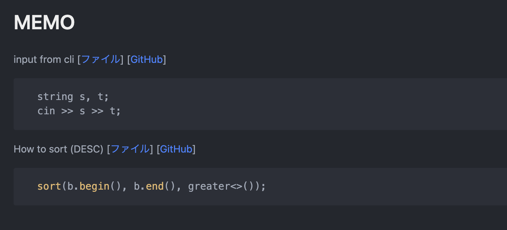
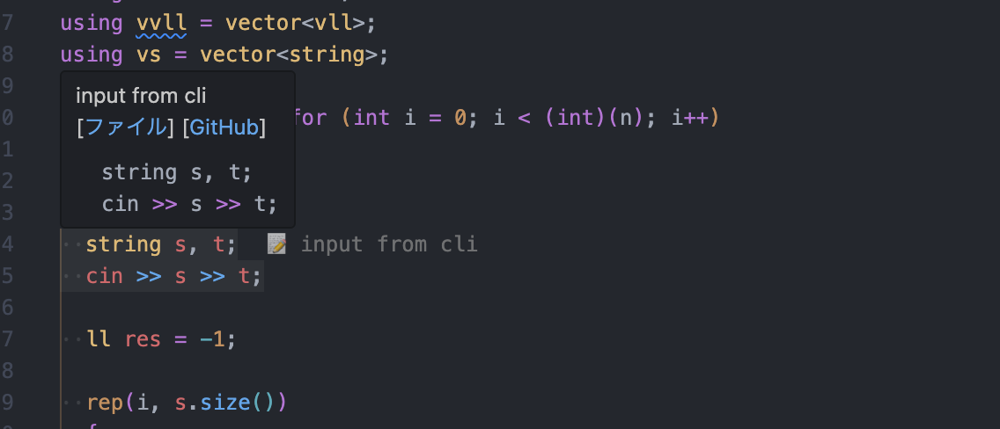

# code-reading-memo

This is a VSCode Extension for code reading.

## Features

- Output memo into markdown file
- Show memo on editor

### Output memo into markdown file

When you add memo, it is added into `*.code_memo.md`.

### Show memo on editor

When you add memo, you can confirm memo on editor.
(It refers to `*.code_memo.json`.)

## Installation

This is not published to the marketplace yet.
So you need to install it manually.

1. Clone this repository
2. Run `pnpm install`
3. Run `vsce package --no-dependencies`
4. Run `code --install-extension code-reading-memo-0.0.1.vsix`
5. [Optional] Set global gitignore for `*.code_memo.md` and `*.code_memo.json` (If you set `codeReadingMemo.fileSuffix` option, you need to set global gitignore for `*.{fileSuffix}.md` and `*.{fileSuffix}.json`)

## Usage

### Add memo

1. Select code on editor
2. Execute `Code Reading Memo: Add memo` from command palette or context menu
3. Input new memo title or select existing memo title
4. Input memo

### Change memo title

1. Execute `Code Reading Memo: New memo` from command palette
2. Input new memo title

## Options

- `codeReadingMemo.fileSuffix`: (String) Suffix of memo file name (default: `code_memo`)
